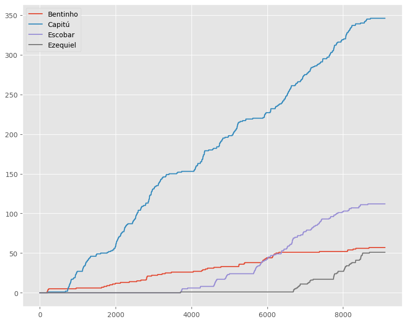

# Aula 1 - Introdução

{: .no_toc .mb-2 }

Apresentando o curso.
{: .fs-6 .fw-300 }

{: .no_toc .text-delta }
Resultados Esperados

1. Entender um pouco de onde veio a ciência de dados
1. Receber as tarefas de configuração do ambiente
1. Ficar motivado!

## Imports Básicos

Código em Python geralmente começa com alguns `imports`. Pense nisso como funcionalidade que precisamos para realizar tarefas de ciências de dados. Geralmente dizemos que estamos importando uma biblioteca. Por exemplo, precisamos tratar com dados? Usamos uma biblioteca para isto. Precisamos plotar gráficos, outra biblioteca.

1. Biblioteca de plots, `matplotlib`
1. Biblioteca de vetores, `numpy`
1. Biblioteca de leitra de dados, `babypandas`.

O foco do nosso curso não é passar por cima de Programação e Desenvolvimento de Software I. Lá, você vai aprender realmente a programar. Python é uma linguagem poderosa tem uma sintaxe simples, que vamos explorar para ciência de dados apenas.


```python
#In:
# Imports. Geralmente você vai apenas copiar essas linhas.
# Não mude elas!!
import babypandas as bpd
import numpy as np

import matplotlib.pyplot as plt
plt.style.use('ggplot')
```


```python
#In:
# Ignore este código, porém execute o mesmo

# Don't worry about what this code does, but make sure to run it if you're following along.

from IPython.display import IFrame
def mostrar_historico():
    src = 'https://docs.google.com/presentation/d/e/2PACX-1vRJnOqqZO6OMMad28fQWCSYG8Nqv2tUxxJ7t8q_aTLoOqw63za0YSK7kzpIYEJNsOzcXqnOg4oMincJ/embed?start=false&loop=false&delayms=3000'
    width = 960
    height = 569
    return IFrame(src, width, height)
```

## Fundamentos de Ciência de Dados - 2024.1

### Bem-vindo ao curso de Ciência de Dados (UFMG)! 👋
- Hoje terermos uma visita guiada à ciência de dados.
- Nosso curso foi desenvolvido pela UC Berkeley em 2015 (data8.org).
- Em 2017 criamos a matéria de Introdução à Ciência de Dados (DCC212).
  - Vocês vão ver essa matéria
  - Porém o data8 era muito simples para o quarto período
- Voltamos com a ideia de ter o data8 no primeiro período no curso de Ciência de Dados
- Nos baseamos na abordagem de sucesso da UCSD (data10.com)
  - Também adaptada de Berkeley
- **Objetivo:** Aprenda programação e estatísticas suficientes para fazer ciência de dados.
  - Estatísticas sem muita matemática, principalmente simulação.
  - Estabelece as bases para todos os outros cursos do curso.

### Agenda

- Pessoal do curso.
  - Professores e Monitores
- O que é ciência de dados?
- Como será esse curso?
- Demonstração com base na literatura.

## Equipe do curso

### Professor: Flavio Vinicius Diniz de Figueiredo (DCC)

<center></center>

- BSc em Ciência da Computação pela UFCG
- Mestrado e Doutorado em Ciência da Computação pela UFMG
  - Estudos parciais na Carnegie Mellon University e University of Brittish Columbia
- Já ensinou mais de 20 turmas de Introdução à Ciência de Dados (4o Período)
- Membro da comissão que fundou o curso
  - Em particular, focou na definição da grade.

### Professor: Uriel Moreira Silva (DEST)

<center></center>

- Possui graduação em Ciências Econômicas pelo Grupo IBMEC
- Mestrado e Doutorado em Estatística pela UFMG
- Recem contratado do departamento, porém professor desde 2021
- Mais de 30 artigos em eventos e períodicos de estatística
- Diversos prêmios na comunidade estatística

### Monitores

Além disso, temos uma equipe de monitores para ajudar vocês.

- **Dois Monitores de Mestrado**: Thiago Poppe e João Pedro.
- **XX Monitores de graduação**: Ainda será definido
- **A comunicação com os monitres é via Moodle (já falo disso breve)**

## O que é “ciência de dados”? 🤔

<center>Todo mundo parece ter sua própria definição de ciência de dados.</center>

### O que é "ciência de dados"?

A ciência de dados trata de **tirar conclusões úteis a partir de dados usando computação**. Ao longo do semestre, abordaremos vários aspectos da ciência de dados:

- Primeiros meses: usando Python para **explorar** dados.
- Muita visualização 📈📊 e “manipulação de dados”, utilizando ferramentas padrão da indústria.

- Próximas dois meses: use dados para **inferir** sobre uma população, dada apenas uma amostra.
- Confie fortemente na simulação, em vez de fórmulas.

- Últimas duas semanas: use dados do passado para **prever** o que pode acontecer no futuro.
- Um gostinho de aprendizado de máquina 🤖.

### A ciência de dados é mais relevante do que nunca 🤧

Passamos alguns anos analisando gráficos como este:

<center></center>

### Também pode ser divertido!

<center></center>

Do artigo de [The Pudding](https://pudding.cool/) em [The Pudding](https://pudding.cool/).

### De onde vem a "ciência de dados"?


```python
#In:
mostrar_historico()
```


<iframe
    width="960"
    height="569"
    src="https://docs.google.com/presentation/d/e/2PACX-1vRJnOqqZO6OMMad28fQWCSYG8Nqv2tUxxJ7t8q_aTLoOqw63za0YSK7kzpIYEJNsOzcXqnOg4oMincJ/embed?start=false&loop=false&delayms=3000"
    frameborder="0"
    allowfullscreen

></iframe>


## Logística do curso

### Site do curso

O site do curso é o seu ponro de partida para a parte de **estudo**.

<center><h3><a href="https://flaviovdf.io/fcd">https://flaviovdf.io/fcd</a></h3></center>

- No site tem o material base do curso
- Perguntas para estudos para as provas
- Calendário e outras informações
- Porém, comunicação, tarefas e entregas são via [Moodle](https://virtual.ufmg.br)!

### Ambientes da UFMG

- **Moodle**: fórum de perguntas e respostas. Todos os anúncios serão feitos aqui.
- **Virtual Programming Lab**: onde você enviará todas as tarefas para avaliação automática. Dentro do moodle.

### Aulas

- As aulas serão presenciais!!
- A participação nunca será exigida, mas é incentivada. Caso você seja reprovado na matéria e tenha menos que 75% de presença, **reprovação por falta!!** (isso é ruim). Caso passe, não olhamos suas presenças.
- Os slides/código da aula serão vinculados ao site do curso, tanto em formato de código "executável" quanto em arquivo HTML (✏️), que você pode salvar como PDF e anotar em seu tablet.
- Tentaremos tornar as palestras envolventes. **Traga seu laptop ou tablet**, se tiver.

### Tarefas de Laboratório (Moodle) e Monitoria

- Os laboratórios referem-se a **tarefas de programação**, que são uma parte obrigatória do curso e ajudam você a desenvolver fluência em Python e no trabalho com dados.
- Ao trabalhar nos laboratórios, você poderá executar **testes de autoavaliação** que informam se suas respostas estão corretas.
- Para laboratórios, se você passar em todos os testes obterá 100%!
- Você deve enviar laboratórios individualmente, mas pode discutir ideias com outras pessoas (sem compartilhamento de código).

As sessões de monitoria servem para que você pratique as **ideias** do curso.

1. Os conjuntos de problemas serão publicados no Moodle
2. Você tem um prazo de entrega (alguns dias)
3. Você tenta resolver, não consegue? Busca a monitoria!!

**A participação não é obrigatória, porém ajuda!!**

### Cronograma do Curso

### Projeto

- No **Projeto Intermediário** e no **Projeto Final**, você se aprofundará em um conjunto de dados! Os projetos são mais longos do que os trabalhos de casa, por isso damos-lhe mais tempo para trabalhar neles.
- Projetos deste semestre: Restaurantes 🍔 e Great British Bake Off Great British Bake Off 👩‍🍳🍰.
- Você pode trabalhar em projetos com parceiros (pares). Os dois devem contribuir ativamente em **todas as partes** do projeto.

### Avaliações

* Provas Teóricas (2 x 25 pts): 50 pontos.
* Atividades práticas (10 Laboratórios de 2 pts): 20 total.
* Projeto: 30 pontos.

### Leituras e recursos

- Faremos leituras de duas fontes. As leituras de cada palestra serão publicadas na página inicial do curso.
- [Computational and Inferential Thinking (CIT)](https://inferencialthinking.com), o livro criado para a versão deste curso em Berkeley.
- [`babypandas` notes](https://notes.dsc10.com), escrito especificamente para ajudar discentes que estão iniciando em ciência de dados!

- <span style='color:red'><b>🚨 Essa Lista Vai Aumentar!!</b>.</span>

### Primeira tarefa
- O laboratório 0 será entregue **Domingo, 24 de Março às 23h59**.
- Será lançada até quinta. Discutirei em sala!
- <span style='color:red'><b>🚨 Importante: comece cedo e envie com frequência</b>.</span>

### Conseguindo ajuda

Este é um curso introdutório, porém pode ser pesado para algumas pessoas. Além do mais, estamos na primeira oferta do curso! Precisamos de sua ajuda para ponderar o material!

Saiba que estamos aqui para ajudá-lo – veja como:

- Procure os professores em suas salas. Caso não ache os mesmos, mande e-mail.
- Procure os monitores para ajudas nas tarefas.
- Procure o colegiado e representantes do curso.

### Colaboração

#### Fazer perguntas é altamente recomendável!
- Discuta todas as questões entre si (exceto as provas).
- Envie tarefas de laboratório individualmente, mas você pode trabalhar com outras pessoas (sem compartilhamento de código).
- Apresentar projetos individualmente ou em pares.

#### Os limites da colaboração:
- Não compartilhem soluções entre si nem olhem o código de alguém.
- Os parceiros do projecto devem contribuir para todas as partes do projecto. Não divida o projeto.
- Violações de integridade acadêmica geralmente resultam em reprovação no curso.

### Estamos aqui para ajudá-lo!

Independentemente da sua formação, você pode ter sucesso neste curso. **Nenhuma experiência anterior em programação ou estatística será assumida!**

Assista no YouTube: [We’re All Data Scientists | Rebecca Nugent | TEDxCMU](https://www.youtube.com/watch?v=YMnqPTLoj7o).

### Sua Saúde Mental!!

A UFMG conta com serviços de acolhimento e psicologia. Se você ou alguém que você conhece precisar de cuidados de saúde mental, entre em contato!

<center><h3><a href="https://www.icex.ufmg.br/icex_novo/acolhimento/">Acolhimento ICEx</a></h3></center>

<center><h3><a href="https://www.ufmg.br/saudemental/">Saúde Mental UFMG</a></h3></center>

- **Não adoeça pelo curso!**
- Um curso de exatas é bastante puxado. Porém você tem recursos.
- Tranque matérias, é melhor do que perder as mesmas.
- Pegue menos matérias.
- Procure os serviços acima e o colegiado do curso.
- **Fale com os professores (os desta disciplina estão dispostos a conversar)**

## Demo de Ciência de Dados

Abrimos arquivos com "open". A função print serve para imprimir dados. Note como no notebook tudo ocorre no browser.


```python
#In:
livro = open('01-Introducao/data/dom-casmurro.txt')
print(livro.readline())
```

    The Project Gutenberg EBook of Dom Casmurro, by Machado de Assis


Além do mais agora estamos fazendo uso de um laço for. Note que não temos chaves nem ; em nenhum momento. Blocos de código em Python são definidos pela identação.


```python
#In:
livro = open('01-Introducao/data/dom-casmurro.txt')
livro_inteiro = livro.readlines()
```


```python
#In:
livro_inteiro[256] # acessando uma linha do livro
```


    'que sabe do todos. Comtudo, uma promessa de tantos annos... Mas, que\n'


```python
#In:
nomes = ['Bentinho', 'Capitú', 'Escobar', 'Ezequiel']
for linha in livro_inteiro:
    for nome in nomes:
        if nome in linha:
            print(linha)
```

    --D. Gloria, a senhora persiste na ideia de metter o nosso Bentinho no

    me parece bonito que o nosso Bentinho ande mettido nos cantos com a

    --É um modo de falar. Em segredinhos, sempre juntos. Bentinho quasi

    nada que faça desconfiar. Basta a edade; Bentinho mal tem quinze annos.

    Capitú fez quatorze á semana passada; são dous creançolas. Não se

    principal. Bentinho ha de satisfazer os desejos de sua mãe. E depois

    Capitú e eu. Ella servia de sacristão, e alteravamos o ritual, no

    Com que então eu amava Capitú, e Capitú a mim? Realmente, andava cosido

    a de sempre. Capitú chamava-me ás vezes bonito, mocetão, uma flòr;

    lindos que os meus. Então Capitú abanava a cabeça com uma grande

    Capitú um dia notou a differença, dizendo que os della eram mais

    adverti que era phenomeno recente accordar com o pensamento em Capitú,

    Bondade, nem as demais Virtudes eternas. Em amava Capitú! Capitú

    Capitú.

    --Capitú!

    uma porta de communicação mandada rasgar por minha mãe, quando Capitú

    do outro com muitas mesuras. Quando as bonecas de Capitú adoeciam,

    exclamava Capitú. Então eu coçava o queixo, como o doutor, e acabava

    --Capitú!

    e entrei. Capitú estava ao pé do muro fronteiro, voltada para elle,

    de perto, e dei um passo. Capitú agarrou-me, mas, ou por temer que

    Voltei-me para ella; Capitú tinha os olhos no chão. Ergueu-os logo,

    Era o pae de Capitú, que estava á porta dos fundos, ao pé da mulher.

    Soltámos as mãos depressa, e ficámos atrapalhados. Capitú foi ao muro,

    --Capitú!

    Capitú riscava sobre o riscado, para apagar bem o escripto. Padua saiu

    Olhei para um pé do sabugueiro que ficava perto; Capitú respondeu por

    --Estavamos, sim, senhor, mas Bentinho ri logo, não aguenta.

    legitimar a resposta de Capitú. Esta, cançada de esperar, desviou

    artificialmente tarde. Capitú, após duas voltas, foi ter com a mãe,

    pelo ceu nem pela terra. Meu desejo era ir atraz de Capitú e falar-lhe

    Pae nem mãe foram ter comnosco, quando Capitú e eu, na sala de visitas,

    falavamos do seminario. Com os olhos em mim, Capitú queria saber que

    Capitú, a principio não disse nada. Recolheu os olhos, metteu-os

    faltasse na hora da morte se fosse para o seminario. Capitú não parecia

    Fiquei aturdido. Capitú gostava tanto de minha mãe, e minha mãe della,

    de ouro e um livro de _Horas..._ Quiz defendel-a, mas Capitú não me

    a Capitú do costume, mas quasi. Estava seria, sem afflicção, falava

    Capitú reflectia. A reflexão não era cousa rara nella, e conheciam-se

    lhe pude dar toda a significação. A attenção de Capitú estava agora

    antes, que peguei da mão della e apertei-a muito. Capitú deixou-se ir,

    --Não, respondeu Capitú.

    Comprei-as, mas tive de as comer sósinho; Capitú recusou. Vi que, em

    Como vês, Capitú, aos quatorze annos, tinha já ideias atrevidas,

    a Europa, Capitú, se pudesse cumpril-o, não me faria embarcar no

    --Não importa, continuou Capitú; dirá agora outra cousa. Elle gosta

    --Não acho. não, Capitú.

    falar a José Dias nos termos propostos. Capitú repetiu-os, accentuando

    recommendações de Capitú: «Preciso falar-lhe, _sem falta_, amanhã;

    muito, um meio termo. «E Capitú tem razão, pensei, a casa é minha, elle

    ter seguido o conselho de Capitú. Então, como eu quizesse ir para

    Capitú. Não disse mal della; ao contrario insinuou-me que podia vir a

    tempo, modificou os elogios a Capitú, e até lhe fez algumas criticas,

    Capitú, apesar daquelles olhos que o diabo lhe deu... Você já reparou

    --Pois que outra cousa, Bentinho?

    «José Dias, preciso metter Bentinho no seminario.»

    --Estamos a bordo, Bentinho, estamos a bordo!

    adiante, mas eu pensei em Capitú e no seminario, tirei dous vintens do

    confiaria. esta ideia a Capitú. «Sua Majestade pedindo, mamãe cede,»

    Bentinho?

    tempo. Viva a medicina! Iria contar estas esperanças a Capitú.

    --Bem, cedo ao nosso Bentinho, suspirou o pae de Capitú.

    --Bem, cedo ao nosso Bentinho, suspirou o pae de Capitú.

    de minha mãe, doeu-me mais, e, quando emfim pensei em Capitú, senti um

    A imagem de Capitú ia commigo, e a minha imaginação, assim como lhe

    As curiosidades de Capitú.

    Capitú preferia tudo ao seminario. Em vez de ficar abatida com a

    --Não, Bentinho, deixemos o imperador socegado, replicou; fiquemos por

    Capitú quiz que lhe repetisse as respostas todas do aggregado, as

    que a outra, mas a optima dellas é nenhuma. Capitú era Capitú, isto é,

    Era tambem mais curiosa. As curiosidades de Capitú dão para um

    lingua de meninas. Capitú confessou-me um dia que esta razão accendeu

    --Anda apanhar um capotinho, Capitú, dizia-lhe elle.

    Capitú obedecia e jogava com facilidade, com attenção, não sei se diga

    Um dia, Capitú quiz saber o que eram as figuras da sala de visitas. O

    Capitú não achava bonito o perfil de Cesar, mas as acções citadas por

    A perola de Cesar accendia os olhos de Capitú. Foi nessa occasião

    --São joias viuvas, como eu, Capitú.

    curiosidades de Capitú, mobilias antigas, alfaias velhas, costumes,

    Tudo era materia ás curiosidades de Capitú. Caso houve, porém, no qual

    --Que tem, tem, interrompeu Capitú. E se não fosse preciso alguem para

    porém... É um inferno isto! Você teime com elle, Bentinho.

    --Juro! Deixe ver os olhos, Capitú.

    sabia, e queria ver se se podiam chamar assim. Capitú deixou-se fitar e

    dizer o que foram aquelles olhos de Capitú. Não me acode imagem capaz

    tempo não marcado, agarrei-me definitivamente aos cabellos de Capitú,

    Capitú deu-me as costas, voltando-se para o espelhinho. Peguei-lhe dos

    Em vez de ir ao espelho, que pensaes que fez Capitú? Não vos esqueçaes

    quo estava sentada, de costas para mim. Capitú derreou a cabeça, a tal

    --Levanta, Capitú!

    Grande foi a sensação do beijo; Capitú ergueu-se, rapida, eu recuei

    Quando elles me clarearam, vi que Capitú tinha os seus no chão. Não

    Ouvimos passos no corredor; era D. Fortunata. Capitú compoz-se

    --O que, mamãe? Isto? redarguiu Capitú desfazendo as tranças. Ora,

    Capitú fechava-me os labios. Uma exclamação, um simples artigo, por

    sentir sómente os beiços de Capitú... Sentia-os estirados, embaixo dos

    era da mesma opinião. Outra vez senti os beiços de Capitú. Talvez abuso

    --Prepara-te, Bentinho; tu pódes vir a ser protonotario apostolico.

    agarrar Capitú, desfazer-lhe as tranças, refazel-as e concluil-as

    casa de Capitú. Quando alli cheguei, dei com ella na sala, na mesma

    Capitú recuou um pouco.

    executal-a; mas ainda que eu conhecesse o texto, as attitudes de Capitú

    mãe, e disse delle cousas feias e duras. Capitú reflectiu algum tempo,

    tremulo. Era a ideia com mãos. Quiz puxar as de Capitú, para obrigal-a

    vontades, e Capitú, que me resistia agora, aproveitaria o gesto para

    que cançou; mas então foi a vez da bocca. A bocca de Capitú iniciou um

    Nisto ouvimos bater á porta e falar no corredor. Era o pae de Capitú,

    «Abre, Nanata! Capitú, abre!» Apparentemente era o mesmo lance da

    Capitú, antes que o pae acabasse de entrar, fez um gesto inesperado,

    Capitú, em pé, de costas para mim, inclinada sobre a costura, como a

    --Mas, Bentinho, que ó protonotario apostolico?

    dous lances de ha quarenta annos, é para mostrar que Capitú não se

    porque a filha falava em protonotario apostolico. Capitú repeliu-lhe

    outro. Cabral ouviu as palavras de Capitú com infinito prazer.

    --Obrigado, Capitú, muito obrigado; estimo que você goste tambem. Papae

    A todas as perguntas, Capitú ia respondendo promptamente e bem.

    da mesma opinião. Capitú, cosida ás saias de minha mãe, não attendia

    mundo, se acabasse, mas Capitú não me appareceu. Não deixou minha mãe,

    --Vae com ella, Bentinho, disse minha mãe.

    --Adeus, Capitú.

    mas, Capitú que ia depressa, estacou e fez-me signal que voltasse. Não

    ouvissemos alguma cousa que não entendí bem nem mal. Capitú segredou-me

    Capitú.

    de Capitú. Quantas intenções viciosas ha assim que embarcam, a meio

    Capitú, quando havia chamado minha mãe justamente para confirmal-as;

    segredinhos com Capitú, como lhe dissera José Dias. Calou-se durante

    com tanto gosto! Como é que agora...? Não creio, não, Bentinho. E

    mentir nem faltar, Bentinho; são cousas que não se fazem sem peccado, e

    Deus que é grande e poderoso, não me deixaria assim, não, Bentinho; eu

    manha, Bentinho.

    --Não, não peço. Estás tonto, Bentinho? E como havia de saber que Deus

    Capitú reflectindo.

    No dia seguinte fui á casa visinha, logo que pude. Capitú despedia-se

    atal-o, mas Capitú respondeu que não era preciso, estava boa.

    Ficámos sós na sala; Capitú continuou a narração da mãe, accrescentando

    Capitú ouvia-me com attenção sofrega, depois sombria; quando acabei,

    Mas eu creio que Capitú olhava para dentro de si mesma, emquanto que

    tornei a olhar para Capitú, vi que não se mexia, e fiquei com tal medo

    que a sacudi brandamente. Capitú tornou cá para fora e pediu-me que

    dissimulado, chama-me compassivo; é certo que receiava perder Capitú,

    que eu reputava certo, ainda que demorado. Capitú reflectia, reflectia,

    Capitú fez um gesto de impaciencia. Os olhos de ressaca não se mexiam

    sem que os olhos de ressaca de Capitú deixassem de crescer para mim,

    a tal ponto que as fizeram esquecer de todo. O erro de Capitú foi

    normaes, e dar-lhes o movimento do costume. Capitú tornou ao que era,

    --Não é nada, Bentinho. Pois quem é que ha de dar pancada ou prender

    --Não, Capitú; você não está brincando; nesta occasião, nenhum de nós

    o ceu estava coberto. Capitú falou novamente da nossa separação, como

    buscasse agora razões para animal-a. Capitú, quando não falava, riscava

    Capitú olhou para mim, mas de um modo que me fez lembrar a definição

    --Não fale em morrer, Capitú!

    Capitú teve um risinho descorado e incredulo, e com a taquara escreveu

    secreta esperança de vel-a atirar-se a mim lavada em lagrimas. Capitú

    --Pois, sim, Capitú, você ouvirá a minha missa nova, mas com uma

    --Não, Bentinho, disse, seria esperar muito tempo; você não vae ser

    do autor. Todavia, não ha nada mais exacto. Foi assim mesmo que Capitú

    primeiro filho, o primeiro filho de Capitú, o casamento della com

    estupido. Capitú sorria; eu via o primeiro filho brincando no chão...

    para ir embora, mas nem me levantei, nem sei se iria. Capitú fitou-me

    agora as culpas para si, e pediamos reciprocamente perdão. Capitú

    --Não foi por nada, respondeu Capitú, depois de alguma hesitação...

    A explicação agradou-me; não tinha outra. Se, como penso, Capitú

    verdade não saiu, ficou em casa, no coração de Capitú, cochilando o

    Capitú não hesitou em jurar, e até lhe vi as faces vermelhas de prazer.

    --Tudo póde ser, Bentinho. Você póde achar outra moça que lhe queira,

    --Mas eu tambem juro! Juro, Capitú, juro por Deus Nosso Senhor que só

    Capitú temia a nossa separação, mas acabou acceitando este alvitre, que

    vocação ecclesiastica do nosso Bentinho se manifesta clara e decisiva.

    Capitú deu-me egual conselho, quando minha mãe lhe annunciou a minha

    qualquer cousa. Entrou a achar em Capitú uma porção de graças novas, de

    e, depois de algumas hesitações, resolveu dar-lh'a. Os olhos de Capitú,

    era leval-os a Capitú, ao sair; mas tive ideia de dal-o ao pae, a filha

    «Benção, nhõ Bentinho! não se esqueça de sua Joanna! Sua Miquelina fica

    Quem era a flòr? Capitú, naturalmente; mas podia ser a virtude, a

    melhor não ser Capitú; seria a justiça. Era mais proprio dizer que, na

    Eis aqui outro seminarista. Chamava-se Ezequiel de Souza Escobar. Era

    Eis aqui outro seminarista. Chamava-se Ezequiel de Souza Escobar. Era

    catholicos. Escobar tinha uma irmã, que era um anjo, dizia elle.

    Escobar contava-me historias della, interessantes, todas as quaes

    que me fariam capaz de acabar casando com ella, se não fosse Capitú.

    pousados. Escobar veiu abrindo a alma toda, desde a porta da rua até

    chaves nem fechaduras, bastava empurral-as, e Escobar empurrou-as e

    soneto, as meias, as ligas, o seminarista Escobar e vários outros. Vás

    --Mostrar a verdade, porque, francamente, Bentinho, eu ha mezes que

    --Capitú como vae?

    da minha repulsa ao seminario era Capitú, e lazer crer improvavel a

    Dias que me explicasse a alegria de Capitú, o que é que ella fazia, se

    para Capitú,--e tão senhor me sentia della que era como se olhassem

    possivel, mas certo. E a alegria de Capitú confirmava a suspeita; se

    chegar a casa do Padua, agarrar Capitú e intimar-lhe que me confessasse

    Cuidei naturalmente que falava ainda de Capitú, e quiz perguntar-lh'o,

    janella. Corri ao logar, elle fugiu; avancei para Capitú, mas não

    a sorte grande. Emquanto elle falava, Capitú dava-me com os olhos

    como as suas esperanças do bilhete. Capitú inclinou-se para fóra,

    mim, os rapazes tambem, e Escobar mais que os rapazes e os padres. No

    esperanças; Capitú refreou-me.

    --Escobar é muito meu amigo, Capitú!

    --Escobar é muito meu amigo, Capitú!

    --E você, Capitú, interrompeu minha mãe voltando-se para a filha do

    Padua que estava na sala, com ella,--você não acha que o nosso Bentinho

    --Acho que sim, senhora, respondeu Capitú cheia de convicção.

    entrada no seminario, quando eu vivia curtido de saudades. Capitú

    estando a falar de moças que se casam cedo, Capitú lhe dissera: «Pois a

    mim quem me ha de casar ha de ser o padre Bentinho; eu espero que elle

    dissimulação de Capitú que não vi mais nada, e, logo que almocei, corri

    a referir-lhe a conversa e a louvar-lhe a astucia. Capitú sorriu de

    --Você tem razão, Capitú, concluí eu; vamos enganar toda esta gente.

    Capitú ia agora entrando na alma de minha mãe. Viviam o mais do tempo

    Capitú ia lá coser, ás manhãs; alguma vez ficava para jantar.

    detestar Capitú, nem ella precisava de razões supplementares. Comtudo,

    a intimidade de Capitú fel-o mais aborrecivel á minha parenta. Se a

    fugindo-lhe. Capitú, attenta, desde que a não via, indagava della e

    infringir deslavadamente. Demais, Capitú usava certa magia que captiva;

    quiz que Capitú lhe servisse de enfermeira. Prima Justina, posto que

    se Bentinho não estiver ao pé de mim.

    --Que é, Bentinho?

    Capitú, que estava na alcova, gostou de ver a minha entrada, os

    Era sinhásinha Sancha, a companheira de collegio de Capitú, que

    deu-me rocommendações para Capitú e para minha mãe. Da rua olhei para

    Visita de Escobar.

    «A missa das oito já ha de ter acabado... Bentinho devia estar de

    Era o dia das boas sensações. Escobar foi visitar-me e saber da saude

    uma vez o pae no Rio de Janeiro. Escobar era muito polido; e, comquanto

    que de costume. Tio Cosme quiz que jantasse comnosco. Escobar reflectiu

    Escobar acceitou, e jantou. Notei que os movimentos rápidos que tinha e

    Os olhos de Escobar, claros como já disse, eram dulcissimos; assim

    agradassem a todos. Em casa, ficaram querendo bem a Escobar; a mesma

    Escobar despediu-se logo depois de jantar; fui leval-o á porta,

    Não é preciso dizer que era Capitú. São cousas que se adivinham na

    Capitú, que nos espreitara desde algum tempo, por dentro da veneziana,

    --É o Escobar, disse eu indo pôr-me embaixo da janella, a olhar para

    Assim se explicam a minha estada debaixo da janella de Capitú e a

    mas voltou a cabeça para o nosso lado, o lado de Capitú, e olhou

    para Capitú, e Capitú para elle; o cavallo andava, a cabeça do homem

    Nem disse nada a Capitú; saí da rua á pressa, enfiei pelo meu corredor,

    Capitú saisse da janella assustada e não tardasse a apparecer, para

    Capitú e os peraltas do bairro; agora, imaginando que vinha justamente

    --Que é, Bentinho?

    ver Capitú aquella tarde, nem nunca mais, e fazer-me padre de uma vez.

    fosse o abalo que me deu, não me fez sair do quarto. Capitú ria alto,

    congestão. Ergui-me de golpe, mas não saí do quarto. Capitú ria agora

    seminario e falar a Capitú. Podia estar zangada commigo, podia não

    a alguem o que se passava entre mim e Capitú. Não referi tudo, mas só

    uma parte, e foi Escobar que a recebeu. Quando voltei ao seminario,

    --Escobar....

    --Escobar, você é meu amigo, eu sou seu amigo tambem; aqui no seminario

    --Escobar, você é capaz de guardar um segredo?

    --Escobar, eu não posso ser padre. Estou aqui, os meus acreditam, o

    ter o gosto de repisar o assumpto. Escobar escutava com interesse; no

    vezes; eu louvava as qualidades moraes de Capitú, materia adequada á

    casa; Capitú vae passar uns dias com uma amiga da rua dos Invalidos.

    Escobar, que apenas trocara com ella quatro palavras. Uma só bastava a

    Capitú. Esta começou a fazer-se-lhe necessaria. Pouco a pouco veiu-lhe

    Capitú era naturalmente o anjo da Escriptura. A verdade é que minha mãe

    por actos extraordinarios. Capitú passou a ser a flôr da casa, o sol

    primeiro sabbado, quando eu cheguei a casa, e soube que Capitú estava

    --Pois então? Mas é se queres. Capitú devia ter voltado hoje para

    ceu azul. Foi Capitú que os trouxe á porta da sala, vindo dizer ao pae

    Capitú trazia signaes de fadiga e commoção, mas tão depressa me viu,

    fizemos, Capitú e eu. Vagamente lembra-me que lhe perguntei se a demora

    --Conselho della? murmurou Capitú.

    Gurgel tornou á sala e disse a Capitú que a filha chamava por ella.

    cadeiras. Ao contrario, Capitú ergueu-se naturalmente e perguntou-lhe

    Nem sobresalto nem nada, nenhum ar de mysterio da parte de Capitú;

    Capitú se governasse tão facilmente e eu não?

    Murmurei que sim. Na verdade, Capitú ia crescendo ás carreiras, as

    perguntou-me se Capitú era parecida com o retrato.

    aborrece ou impõe. Antes de examinar se effectivamente Capitú era

    satisfeito com a visita, com a alegria de Capitú, com os louvores de

    --Sr. Bentinho! Sr. Bentinho!

    --Sr. Bentinho, disse-me elle chorando; sabe que meu filho Manduca

    importante era Capitú. O mal foi que os dous casos se conjugassem na

    cara fresca e lepida de Capitú... Amai, rapazes! e, principalmente,

    --Senta, Bentinho!

    Matacavallos, que tem um filho, Bentinho...»

    seguinte, não iria ao seminario, e podia fazer outra visita a Capitú,

    Contava que tudo me saisse como naquelle dia, Gurgel afflicto, Capitú

    elle; duas pessoas vieram ajudal-o, Capitú, cuja imagem dormiu commigo

    Escobar que no domingo, antes do meio dia, veiu ter a Matacavallos. Um

    --Você janta commigo, Escobar?

    Todos ficaram gostando delle. Eu estava tão contente como se Escobar

    que o meu amigo Escobar era um tanto mettidiço e tinha uns olhos

    Quando eu referi a Escobar aquella opinião de minha mãe (sem lhe contar

    --Não é possivel! exclamou Escobar. Quarenta annos! Nem parece trinta;

    Contei-lhe o que sabia da vida della e de meu pae. Escobar escutava

    --É casado, disse eu para Escobar. Maria onde está?

    --Todas as lettras do alphabeto, interrompeu Escobar.

    horas deste mundo. Escobar confessou esse accordo do interno com o

    papel os algarismos das casas e dos alugueis. Escobar pegou no papel,

    no papel,--fel-o Escobar de cór, brincando. Olhava-me triumphalmente,

    Escobar observou-me que os outros e o padre falavam de inveja e

    Escobar apertou-me a mão ás escondidas, com tal força que ainda me

    A amizade de Escobar fez-se grande e fecunda; a de José Dias não lhe

    ideia é tão santa que não está mal no santuario. Amanhã, Bentinho.

    --É o unico, Bentinho, é o unico! Vou já hoje conversar com D. Gloria,

    --Oh! Bentinho! interrompeu o aggregado. Pensar em que? Você o que

    Rigorosamente, eram duas pessoas, Capitú e Escobar, mas eu neguei a pés

    Rigorosamente, eram duas pessoas, Capitú e Escobar, mas eu neguei a pés

    recommenda ao santissimo filho que todos os seus desejos, Bentinho,

    Vi a alma alliviada de minha mãe, vi a alma feliz de Capitú, ambas em

    tambem, mas a distancia que estaria da vontade de Capitú é que

    não. Eis o ponto essencial. Se Capitú achasse longe, não iria; mas

    era preciso ouvil-a, e assim tambem a Escobar, que me daria um bom

    Expuz a Capitú a ideia de José Dias. Ouviu-me attentamente, e acabou

    Não é de lá que vêm as cantoras? Você esquece-me, Bentinho. E não

    Capitú não achava outra ideia, nem acabava de adoptar esta. De caminho,

    Capitú metteu o negocio á bulha, rindo e chamando-me disfarçado.

    Quando voltei ao seminario, contei tudo ao meu amigo Escobar, que

    --Não, Bentinho, não é preciso isso. Ha melhor,--não digo melhor,

    Escobar observou que, pelo lado economico, a questão era facil; minha

    Sentia-me pilherico. Oh! como a esperança alegra tudo. Escobar sorriu,

    podia havel-o melhor. Escobar ouviu-me contentissimo.

    viçoso, como se o bacharel fosse elle. A mãe de Capitú fallecera, o pae

    Escobar começava a negociar em café depois de haver trabalhado quatro

    entre mim e Capitú. Desde que a viu animou-me muito no nosso amor. As

    com Capitú, e fel-o servir a ambos nós, como amigo. A principio,

    repugnava-me por um resto de respeito de creança. Venceu Escobar; posto

    que vexada, Capitú entregou-lhe a primeira carta, que foi mãe e avó

    casou,--adivinha com quem,--casou com a boa Sancha, a amiga de Capitú,

    é a figura do meu defuncto. Olha, Bentinho, olha bem para mim. Sempre

    «Tu serás feliz, Bentinho!»

    callida: «Tu serás feliz, Bentinho; tu vaes ser feliz.»

    serás rei, Macbeth!»--«Tu serás feliz, Bentinho!» Ao cabo, é a mesma

    não vale nada; agora são os novos, os Escobares... Não lhe nego que é

    Bentinho, foi um modo de accentuar a perfeição daquella moça. Cuidei

    --Positivamente, não; fez-me o favor de perguntar se Capitú não daria

    --Mamãe sempre que me escrevia, falava de Capitú.

    repetia, mas já então sem palavras: «Tu serás feliz, Bentinho » E a voz

    de Capitú me disse a mesma cousa, com termos diversos, e assim tambem

    a de Escobar, os quaes ambos me confirmaram a noticia de José Dias

    que Capitú, que não sabia Escriptura nem latim, decorou algumas

    Não obstante, achei que Capitú estava um tanto impaciente por descer.

    annos para aborrecer-me em sete dias? Não, Bentinho; digo isto porque

    na rua, tudo me mostrou que a causa da impaciencia de Capitú eram os

    Escobar contribuira muito para as minhas estréas no fòro. Interveiu com

    Sancha e Capitú continuavam depois de casadas a amizade da escola,

    Escobar e eu a do seminario. Elles moravam em Andarahy, aonde queriam

    Escobar e a mulher viviam felizes; tinham uma filhinha. Em tempo ouvi

    o marido trabalhador. Como eu um dia dissesse a Escobar que lastimava

    Não vinha. Capitú pedia-o em suas orações, eu mais de uma vez dava

    No mais, tudo corria bem. Capitú gostava de rir e divertir-se, e, nos

    ou a gente que passava na praia. Ás vezes, eu contava a Capitú a

    de Escobar, a quem confiei candidamente os meus tedios; concordou logo

    --Não é? Mas não diga o motivo; hão de chamar-nos seminaristas. Capitú

    Nem por isso deixei de contar a Capitú a approvação de Escobar. Ella

    Nem por isso deixei de contar a Capitú a approvação de Escobar. Ella

    --Você não me ouve, Capitú.

    --Qual, Sirius, Capitú. Ha vinte minutos que eu falei de Sirius.

    Capitú, ao percebel-o, fez-se a mais mimosa das creaturas, pegou-me na

    Capitú fitou-me rindo, e replicou que a culpa de romper o segredo era

    --O seu amigo Escobar.

    mas Capitú deteve-me. Ao contrario, consultou-me sobre o que haviamos

    No dia seguinte, fui ter com Escobar ao armazem, e ri-me do segredo de

    ambos. Escobar sorriu e disse-me que estava para ir ao meu escriptorio

    contar-me tudo. A cunhadinha (continuava a dar este nome a Capitú)

    é que Capitú póde economisar, agora que tudo está tão caro?»--«Não sei,

    --Capitú é um anjo!

    Escobar concordou de cabeça, mas sem enthusiasmo, como quem sentia não

    de Capitú; mas não é por isso que torno a ella, é para que não cuides

    Capitú e ter ciumes do mar. Não, meu amigo. Venho explicar-te que tive

    A verdade é que fiquei mais amigo de Capitú, se era possivel, ella

    mas as cautelas que Capitú empregou para o fim de descobrir-me um dia

    o cuidado de todos os dias. Escobar tambem se me fez mais pegado ao

    pessoa. Quando iamos a Andarahy e viamos a filha de Escobar e Sancha,

    familiarmente Capitúsinha, por differençal-a de minha mulher, visto

    Capitú convalescente. Tambem não caía, porque ha um deus para os paes

    Capitú não era menos terna para elle e para mim. Davamos as mãos um

    mãe e de Sancha, que tambem foi passar com Capitú os primeiros dias e

    tinha nada com isso; tambem Capitú, em solteira, fora tratal-a á rua

    --Lembra-me; mas Escobar...

    casmurrice, não sei se ainda ha tal linguagem, mas deve haver. Escobar

    --Póde ser, redarguia Escobar; ninguem diria o que veiu a ser

    Escobar acompanhava muita vez as minhas creancices; tambem interrogava

    A amizade existe; esteve toda nas mãos com que apertei as de Escobar,

    Era minha ideia que Escobar fosse padrinho do pequeno; a madrinha devia

    Contei discretamente a anecdota a Escobar, para que elle me

    Ezequiel; era o de Escobar, e eu quiz supprir deste modo a falta de

    Ezequiel; era o de Escobar, e eu quiz supprir deste modo a falta de

    Ezequiel, quando começou o capitulo anterior, não era ainda gerado;

    chegar o meu Ezequiel aos cinco annos, um rapagão bonito, com os seus

    Aos cinco e seis annos, Ezequiel não parecia desmentir os meus sonhos

    terem toda no coração. Escobar, bom negociante, opinava que a causa

    Gostava de musica, não menos que de doce, e eu disse a Capitú que lhe

    Capitú, e não achei treplica. Fiz, porém, o que ella não esperava;

    Capitú achou á toada um sabor particular, quasi delicioso; contou ao

    filho a historia do prégão, e assim o cantava e teclava. Ezequiel

    gravador e o que era gravura: as curiosidades de Capitú, em summa.

    Um dia, na chacara de Escobar, deu com um gato que tinha um rato

    fugisse. Ezequiel não disse nada, deteve-se, acocorou-se, e ficou

    fez-nos signal que nos calassemos. Escobar concluiu:

    Capitú quiz tambem ver o filho; acompanhei-os. Effectivamente, era

    outros nem tiveram tempo de atalhar-me, Ezequiel ficou abatido.

    Foi quando nasceu Ezequiel; a mãe estava com febre, Sancha vivia ao pé

    As imitações de Ezequiel.

    Tal não faria Ezequiel. Não comporia bolas envenenadas, supponho, mas

    pau. Capitú morria por aquelle batalhador futuro.

    José Dias; já lhe achei até um geito dos pés de Escobar e dos olhos...

    Capitú deixou-se estar pensando e olhando para mim, e disse afinal que

    A resposta do Capitú foi um riso doce de escarneo, um desses risos que

    desconfiança. E certo que Capitú gostava de ser vista, e o meio mais

    nenhuma receberia a minima parte do amor que tinha a Capitú. A minha

    propria mãe não queria mais que metade. Capitú era tudo e mais que

    Escobar; saí, mas voltei no fim do primeiro acto. Encontrei Escobar á

    Capitú, que ficára doente.

    --Doente de que? perguntou Escobar.

    Capitú estava melhor e até boa. Confessou-me que apenas tivera uma

    para me não metter medo, mas jurou que era a verdade pura. Escobar

    Capitú e eu tinhamos jurado não esquecer mais aquelle prégão; foi em

    Escobar me trazia apenas digo o que lhe disse então, isto é, que não

    Tomámos depressa. Durante elle, Escobar olhava para mim desconfiado,

    Quando elle saiu, referi as minhas duvidas a Capitú; ella as desfez

    Capitú!

    --Mas eu tenho notado que já é fria tambem com Ezequiel. Quando elle

    duvidas. Capitú novamente me aconselhou que esperassemos. Sogras

    Ezequiel ás vezes estava com ella; nós o havíamos acostumado a ver o

    os louvores incessantes que elle ouvia «á bella e virtuosa Capitú.»

    «prophetasinho» (assim chamava a Ezequiel) e fez-lhe as festas do

    o livro de Ezequiel, como soube depois), e perguntava-lhe: «Como vae

    --Que filho do homem é esse, perguntou-lhe Capitú agastada.

    --Tem razão, Capitú, concordou o aggregado. Voce não imagina como a

    --Não, atalhou Capitú; já lhe vou tirando esse costume do imitar os

    --Não, Ezequiel, disse eu, mamãe não quer.

    mais repetidos, como o das mãos e pés de Escobar; ultimamente, até

    deixal-a cair, quando ria. Capitú ralhava. Mas o menino era travesso,

    fechou a cara, que o reprehendeu e chamou a si foi Capitú.

    Já então Escobar deixára Andarahy e comprára uma casa no Flamengo, casa

    a historia. Não é que Escobar ainda lá more nem sequer viva; morreu

    mim e Capitú, acharam todos que sim, e Sancha accrescentou que até já

    --Não; é porque Ezequiel imita os gestos dos outros.

    Escobar concordou commigo, e insinuou que alguma vez as creanças que

    ainda o aggregado e prima Justina. Foi então que Escobar, falando-me á

    graças ás relações della e Capitú, não se me daria beijal-a na testa.

    --O mar amanhã está de desafiar a gente, disse-me a voz de Escobar, ao

    grande, e, a distancia, viam-se crescer as ondas. Capitú e prima

    O retrato de Escobar, que eu tinha alli, ao pé do de minha mãe,

    e Capitú eram tão amigas que seria um prazer mais para ellas irem

    nada. O retrato de Escobar pareceu falar-me; vi-lhe a altitude franca e

    estudar uns autos. Capitú e prima Justina sairam para a missa das

    Uma só vez olhei para o retrato de Escobar. Era uma bella photographia

    embaixo, não nas costas do cartão: «Ao meu querido Bentinho o seu

    querido Escobar 20-4-70.» Estas palavras fortaleceram-me os pensamentos

    recado a Capitú e corri ao Flamengo.

    Em caminho, fui adivinhando a verdade. Escobar metteu-se a nadar, como

    gente. Sai de lá cerca de onze horas; Capitú e prima Justina

    o logar em que Escobar fallecèra, ouvindo referir a chegada do morto.

    pequeno. Elogiavam as qualidades de Escobar. Um ou outro discutia

    fizera mais que recordar o tempo do seminario, as relações de Escobar,

    Muitos homem choravam tambem, as mulheres todas. Só Capitú, amparando

    arrancal-a dalli. A confusão era geral. No meio della, Capitú olhou

    As minhas cessaram logo. Fiquei a ver as della; Capitú enxugou-as

    a retinha tambem. Momento houve em que os olhos de Capitú fitaram o

    Não seria o mesmo caso de Capitú? Cuidei de recompôr-lhe os olhos, a

    as duvidas que me affligiam ou a necessidade de affligir Capitú com

    jogando cartas na saleta proxima. Capitú levantou-se do canapé e veiu

    o jogo, e todos falámos do desastre e da viuva. Capitú censurou a

    imprudencia de Escobar, e não dissimulou a tristeza que lhe trazia a

    Capitú saiu para ir ver se o filho dormia. Ao passar pelo espelho,

    José Dias achou a phrase «lindissima», e perguntou a Capitú porque é

    Inventariei as lembranças de Escobar, livros, um tinteiro de bronze,

    uma bengala de marfim, um passaro, o album de Capitú, duas paizagens

    dia: davam noticia do desastre e da morte de Escobar, os estudos e

    eram sublimes de amizade e estima. Capitú desta vez chorou muito; mas

    Porquanto, um dia Capitú quiz saber o que é que me fazia andar calado

    repliquei-lhe que os meus negocios andavam mal. Capitú sorriu para

    advogado rendia-me bastante, Capitú estava mais bella, Ezequiel ia

    advogado rendia-me bastante, Capitú estava mais bella, Ezequiel ia

    --Você já reparou que Ezequiel tem nos olhos uma espressão exquisita?

    perguntou-me Capitú. Só vi duas pessoas assim, um amigo de papae e o

    defuncto Escobar. Olha, Ezequiel; olha firme, assim, vira para o lado

    defuncto Escobar. Olha, Ezequiel; olha firme, assim, vira para o lado

    Era depois de jantar; estavamos ainda á mesa, Capitú brincava com

    mim. Approximei-me de Ezequiel, achei que Capitú tinha razão; eram os

    mim. Approximei-me de Ezequiel, achei que Capitú tinha razão; eram os

    olhos de Escobar, mas não me pareceram exquisitos por isso. Afinal

    semelhanças se dariam naturalmente. Ezequiel não entendeu nada, olhou

    Capitú, alheia a ambos, fitava agora a outra borda da mesa; mas,

    dizendo-lhe eu que, na belleza, os olhos de Ezequiel saíam aos da mãe,

    Capitú sorriu abanando a cabeça com um ar que nunca achei em mulher

    aquelle adagio que quem o feio ama bonito lhe parece. Capitú tinha meia

    nos olhos de Ezequiel.

    Escobar vinha assim surgindo da sepultura, do seminario e do Flamengo

    O que se passava entre mim e Capitú naquelles dias sombrios, não se

    meu amigo e comborço Escobar. Cheiram tambem aos olhos de ressaca de

    Capitú. Assim, posto sempre fosse homem de terra, conto aquella parte

    nos olhos um do outro, vibrante e decisiva, e sempre que Ezequiel vinha

    para nós não fazia mais que separar-nos. Capitú propoz mettel-o em um

    a arte fina de Capitú para fazel-o attenuar, ao menos, foi como se

    a minha paixão. Ezequiel vivia agora mais fóra da minha vista; mas a

    volta de Escobar mais vivo e ruidoso. Até a voz; dentro de pouco, já

    gabinete, quando eu me achava entre jornaes e autos. Ezequiel entrava

    continuava a peça. O ultimo acto mostrou-me que não eu, mas Capitú

    se ella devéras fosse culpada, tão culpada como Capitú? E que morte lhe

    Capitú. Nenhuma das outras era para ella; senti necessidade de lhe

    Escobar e da necessidade de morrer.

    realidade da manhã. Mas a photographia de Escobar deu-me o animo que me

    Quando ia a beber, cogitei se não seria melhor esperar que Capitú e o

    entrei a passear no gabinete. Ouvi a voz de Ezequiel no corredor, vi-o

    estante. Ezequiel abraçou-me os joelhos, esticou-se na ponta dos pés,

    Se eu não olhasse para Ezequiel, é provavel que não estivesse aqui

    impulso foi criminoso. Inclinei-me e perguntei a Ezequiel se já tomára

    Ezequiel abriu a boca. Cheguei-lhe a chicara, tão tremulo que quasi a

    --Papae papae! exclamava Ezequiel.

    Capitú que entra.

    Quando levantei a cabeça, dei com a figura de Capitú deante de mim.

    primeiro, uma vez que a mãe e o filho iam á missa, e Capitú não saía

    Desta vez, ao dar com ella, não sei se era dos meus olhos, mas Capitú

    crises. Capitú recompoz-se; disse ao filho que se fosse embora, e

    --Ha tudo; não entendo as tuas lagrimas nem as de Ezequiel. Que houve

    Capitú respondeu que ouvira choro e rumor de palavras. Eu creio que

    Grande foi a estupefacção de Capitú, e não menor a indignação que

    Capitú, aos seus gestos, á dôr que a retorcia, a cousa nenhuma, repeti

    Ande, Bentinho, fale! fale! Despeça-me d'aqui, mas diga tudo primeiro.

    --Não, Bentinho, ou conte o resto, para que eu me defenda, se você acha

    Não disse tudo; mal pude alludir aos amores de Escobar sem proferir-lhe

    o nome. Capitú não poude deixar de rir, de um riso que eu sinto

    disse-lhe não sei que palavras adequadas a este fim. Capitú olhou para

    Ezequiel, gritando:--«Mamãe! mamãe! é hora da missa!» restituiu-me

    á consciencia da realidade. Capitú e eu, involuntariamente, olhámos

    para a photographia de Escobar, e depois um para o outro. Desta vez

    força alguma photographia de Escobar pequeno que seria o nosso pequeno

    Ezequiel. De bocca, porém, não confessou nada; repetiu as ultimas

    rejeitei a morte, e esperei o regresso de Capitú. Este foi mais

    --Confiei a Deus todas as minhas amarguras, disse-me Capitú ao voltar

    mostrou em casa delle o retrato da mulher, parecido com Capitú. Has

    nos outros dias, Ezequiel ia ter commigo ao gabinete, e as feições

    das andorinhas de fóra, e acharam-lhe graça; Escobar declarou que,

    Capitú, confessando que a aborreciamos, foi a outros cuidados. Agora

    Capitú, ensinando a lingua materna a Ezequiel, que apprenderia o resto

    Capitú, ensinando a lingua materna a Ezequiel, que apprenderia o resto

    Ao cabo de alguns mezes, Capitú começára a escrever-me cartas, a que

    --Não; não posso. Agora, adeus, Bentinho, não sei sé me verá mais;

    esperança delle fosse enterrar-me. Correspondia-se com Capitú, a quem

    pedia que lhe mandasse o retrato de Ezequiel; mas Capitú ia adiando a

    pedia que lhe mandasse o retrato de Ezequiel; mas Capitú ia adiando a

    falar a Ezequiel no velho amigo do pae e do avô, «destinado pelo ceu

    terceira geração; mas a morte veiu antes de Ezequiel. A doença foi

    --Não, Bentinho, disse elle; basta um allopatha; em todas as escolas se

    Escobar. Era o meu comborço; era o filho de seu pae. Vestia de luto

    A voz era a mesma de Escobar, o sotaque era afrancezado. Expliquei-lhe

    aborrecimento, é verdade; a principio doeu-me que Ezequiel não fosse

    continuou a comer. Escobar comia assim tambem, com a cara mettida no

    de que pudesse ter visto alguma photographia de Escobar, que Capitú por

    de que pudesse ter visto alguma photographia de Escobar, que Capitú por

    Ezequiel cria em mim, como na mãe. Se fosse vivo José Dias, acharia

    o desejo de ver Ezequiel era para o fim de verificar no moço o debuxo

    --Está muito mal, disse eu a Ezequiel que queria ir vel-a, qualquer

    Senhor ou como quer que seja. Ezequiel viu-lhe a cara no caixão e não a

    Ao cabo de seis mezes, Ezequiel falou-me em uma viagem á Grecia, ao

    velhas ou novas. Onze mezes depois, Ezequiel morreu de uma febre

    tirada do propheta Ezequiel, em grego: «Tu eras perfeito nos teus

    «Quando seria o dia da creação de Ezequiel?» Ninguem me respondeu. Eis

    propriamente o resto do livro. O resto é saber se a Capitú da praia

    e tu concordarás commigo; se te lembras bem da Capitú menina, has de

                 XIII      Capitú

                 XXXI      As curiosidades de Capitú

                 XLII      Capitú reflectindo

                 LXXI      Visita de Escobar

                 C         «Tu serás feliz, Bentinho!»

                 CXII      As imitações de Ezequiel

                 CXXXVIII  Capitú que entra


```python
#In:
nomes = ['Bentinho', 'Capitú', 'Escobar', 'Ezequiel']
contagens = {}
for nome in nomes:
    contagens[nome] = 0

for linha in livro_inteiro:
    for nome in nomes:
        contagens[nome] += np.char.count(linha, nome)
```


```python
#In:
contagens
```


    {'Bentinho': 57, 'Capitú': 346, 'Escobar': 112, 'Ezequiel': 51}


## Gráficos Simples


```python
#In:
y_values = np.zeros(len(nomes))
for i, nome in enumerate(nomes):
    y_values[i] = contagens[nome]
```


```python
#In:
plt.bar([1, 2, 3, 4], y_values)
plt.xticks([1, 2, 3, 4], nomes)
plt.show();
```


```python
#In:
mencoes_por_linha = {}
for nome in nomes:
    mencoes_por_linha[nome] = np.zeros(len(livro_inteiro))

for i, linha in enumerate(livro_inteiro):
    for nome in nomes:
        mencoes_por_linha[nome][i] += np.char.count(linha, nome)
```


```python
#In:
plt.figure(figsize=(10, 8))
for nome in nomes:
    plt.plot(np.cumsum(mencoes_por_linha[nome]), label=nome)
plt.legend()
plt.show()
```





### Próxima vez

- Na quarta-feira começaremos a programar 💻 em Python 🐍.
- Fique atento aos anúncios via Moodle!
